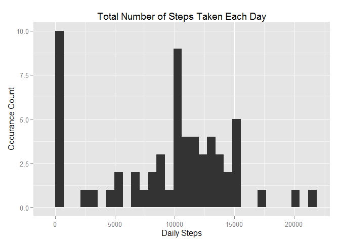

# Reproducible Research: Peer Assessment 1

## Libraries

```r
library(dplyr)
```

```
## 
## Attaching package: 'dplyr'
## 
## The following objects are masked from 'package:stats':
## 
##     filter, lag
## 
## The following objects are masked from 'package:base':
## 
##     intersect, setdiff, setequal, union
```

```r
library(tidyr)
library(ggplot2)
```

## Loading and preprocessing the data

```r
data <- read.csv(unzip('activity.zip'))
```

## What is mean total number of steps taken per day?

### 1. Calculate the total number of steps taken per day

```r
(function(d) { # get summarized steps per day
  d %>% 
    group_by(date) %>%
    select(steps) %>%
    summarise(stepsperday = sum(steps, na.rm = TRUE))
})(data)
```

```
## Source: local data frame [61 x 2]
## 
##          date stepsperday
##        (fctr)       (int)
## 1  2012-10-01           0
## 2  2012-10-02         126
## 3  2012-10-03       11352
## 4  2012-10-04       12116
## 5  2012-10-05       13294
## 6  2012-10-06       15420
## 7  2012-10-07       11015
## 8  2012-10-08           0
## 9  2012-10-09       12811
## 10 2012-10-10        9900
## ..        ...         ...
```

### 2. Make a histogram of the total number of steps taken each day

```r
(function(d) { # generate histogram
  perday <- d %>% 
    group_by(date) %>%
    select(steps) %>%
    summarise(stepsperday = sum(steps, na.rm = TRUE))

  qplot(perday$stepsperday, geom="histogram")
})(data)
```

```
## stat_bin: binwidth defaulted to range/30. Use 'binwidth = x' to adjust this.
```

 

### 3. Calculate and report the mean and median of the total number of steps taken per day

```r
(function(d) { # get mean daily total
  d %>% 
    group_by(date) %>%
    select(steps) %>%
    summarise(stepsperday = sum(steps, na.rm = TRUE)) %>%
    summarise(mean(stepsperday, rm.na = TRUE))
})(data)
```

```
## Source: local data frame [1 x 1]
## 
##   mean(stepsperday, rm.na = TRUE)
##                             (dbl)
## 1                         9354.23
```


```r
(function(d) { # get median daily total
  d %>% 
    group_by(date) %>%
    select(steps) %>%
    summarise(stepsperday = sum(steps, na.rm = TRUE)) %>%
    summarise(median(stepsperday))
})(data)
```

```
## Source: local data frame [1 x 1]
## 
##   median(stepsperday)
##                 (int)
## 1               10395
```


## What is the average daily activity pattern?

### 1. Time series plot of average number of steps takenthe per 5-minute interval 

```r
(function(d) { # get summarized steps per day
  perinterval <- d %>% 
    group_by(interval) %>%
    select(steps) %>%
    summarise(stepsperinterval = mean(steps, na.rm = TRUE))
    
    plot(perinterval$interval, perinterval$stepsperinterval, type = 'l')
})(data)
```

 

### 2. Which averaged 5-minute interval contains the maximum number of steps?

```r
(function(d) { # get summarized steps per day
  d %>% 
    group_by(interval) %>%
    select(steps) %>%
    summarise(stepsperinterval = mean(steps, na.rm = TRUE)) %>%
    filter(stepsperinterval == max(stepsperinterval))
})(data)
```

```
## Source: local data frame [1 x 2]
## 
##   interval stepsperinterval
##      (int)            (dbl)
## 1      835         206.1698
```


## Imputing missing values

### 1. Total number of missing values in the dataset

```r
(function(d){ # count row with na's
  count(data, is.na(steps))
})(data)
```

```
## Source: local data frame [2 x 2]
## 
##   is.na(steps)     n
##          (lgl) (int)
## 1        FALSE 15264
## 2         TRUE  2304
```

### 2. Data filling strategy

Fill in all of the missing values in the dataset using the mean for that 5-minute interval.


```r
dataFillStrategy <- (function(d){
  averageStepData <- d %>% 
    group_by(interval) %>%
    select(steps) %>%
    summarise(stepsperinterval = mean(steps, na.rm = TRUE))

  d %>%
    left_join(averageStepData, by = 'interval') %>%
    mutate(filledSteps = ifelse(is.na(steps), stepsperinterval, steps))
})(data)
```

### 3. Create a new dataset that is equal to the original dataset but with the missing data filled in.

```r
filledData <- dataFillStrategy %>%
  select(filledSteps, date, interval) %>%
  rename(steps = filledSteps)
```
### 4. Make a histogram of the total number of steps taken each day

```r
(function(d) { # generate histogram
  perday <- d %>% 
    group_by(date) %>%
    select(steps) %>%
    summarise(stepsperday = sum(steps, na.rm = TRUE))

  qplot(perday$stepsperday, geom="histogram")
})(filledData)
```

```
## stat_bin: binwidth defaulted to range/30. Use 'binwidth = x' to adjust this.
```

 


```r
(function(d) { # get mean daily total
  d %>% 
    group_by(date) %>%
    select(steps) %>%
    summarise(stepsperday = sum(steps, na.rm = TRUE)) %>%
    summarise(mean(stepsperday, rm.na = TRUE))
})(filledData)
```

```
## Source: local data frame [1 x 1]
## 
##   mean(stepsperday, rm.na = TRUE)
##                             (dbl)
## 1                        10766.19
```


```r
(function(d) { # get median daily total
  d %>% 
    group_by(date) %>%
    select(steps) %>%
    summarise(stepsperday = sum(steps, na.rm = TRUE)) %>%
    summarise(median(stepsperday))
})(filledData)
```

```
## Source: local data frame [1 x 1]
## 
##   median(stepsperday)
##                 (dbl)
## 1            10766.19
```


## Are there differences in activity patterns between weekdays and weekends?


